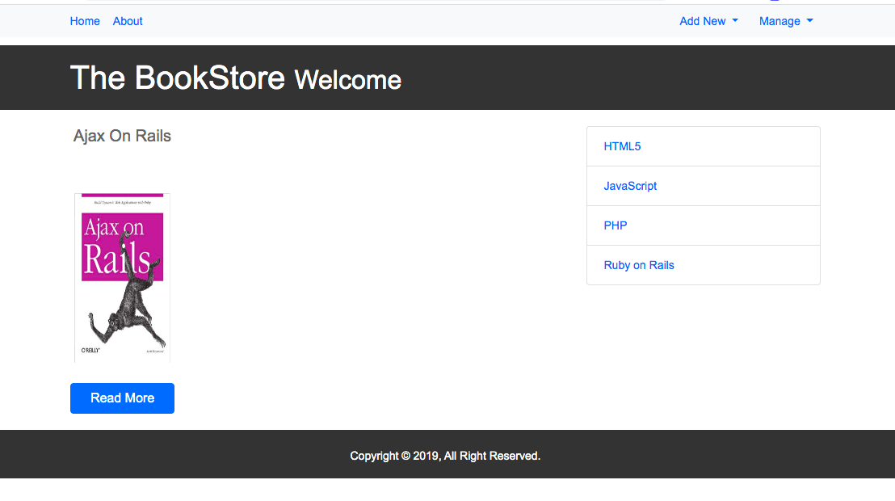

<h1 align=center> **Bookstore App (Rails)** </h1>

[](https://github.com/RichardLitt/standard-readme)
[](https://david-dm.org/dwyl/esta)

This is a sample BookStore application built using Ruby on Rails. It's a bookstore app where you can add the category of the book, publisher, and the author.

the added category, publisher and author are been stored in the database. You can use the added info to add a book.

you can be able to edit and delete the books added.

there is no user authentication for now.




## Background

- HTML
- CSS
- ruby
- rails 
- Rspec
- bootstrap

## Demo
 Check out the live demo of the project. [Click](https://lovely-dry-tortugas-72041.herokuapp.com/)

## Usage
> Clone the repository to your local machine

```sh
$ git clone https://github.com/macbright/book-store-app.git bookstore
```

> cd into the directory

```sh
$ cd bookstore
```

> bundle install to install all the gems

```
$ bundle install --without production
```


> Next, migrate the database:

```
$ rails db:migrate
```

> Finally, run the test suite to verify that everything is working correctly:

```
$ rails test
```

> If the test suite passes, you'll be ready to run the app in a local server:

```
$ rails server
```


## Maintainers 

Okike Bright – [@b_okike](https://twitter.com/b_okike) – brightokike@gmail.com

[https://github.com/macbright/github-link](https://github.com/macbright)


## Contributing

1. Fork it https://github.com/macbright/book-store-app.git)
2. Create your feature branch (git checkout -b feature/[choose-a-name])
3. Commit your changes (git commit -am 'What this commit will fix/add')
4. Push to the branch (git push origin feature/[chosen name])
5. Create a new Pull Request

## License

The Rails Templates script is released under the
[MIT license](https://opensource.org/licenses/MIT).